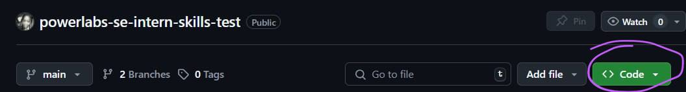
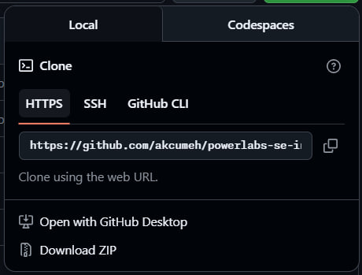
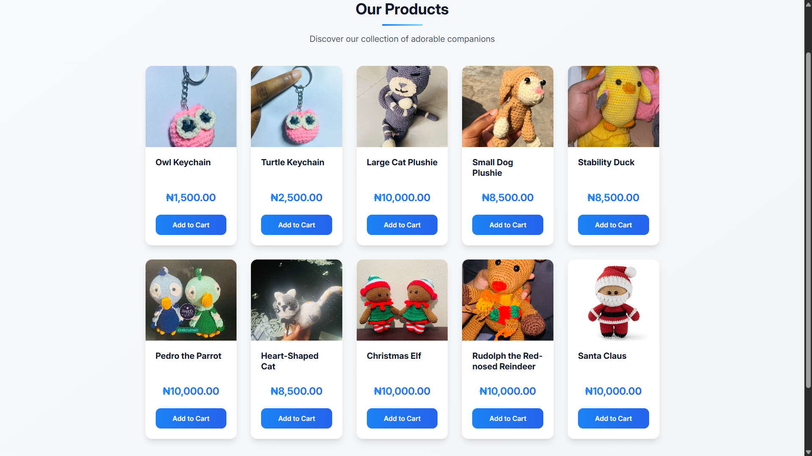
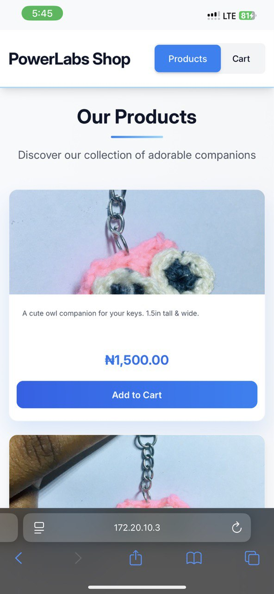
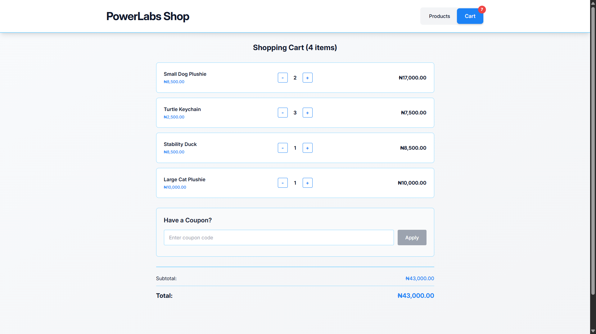
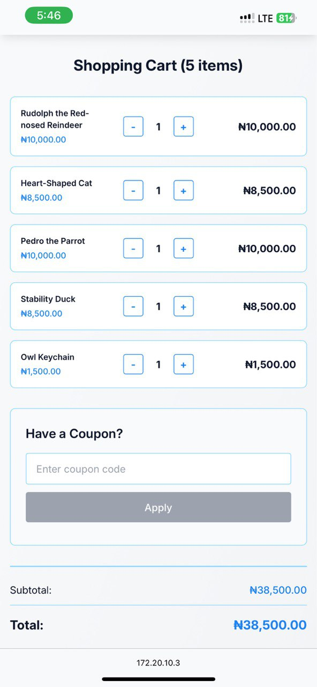
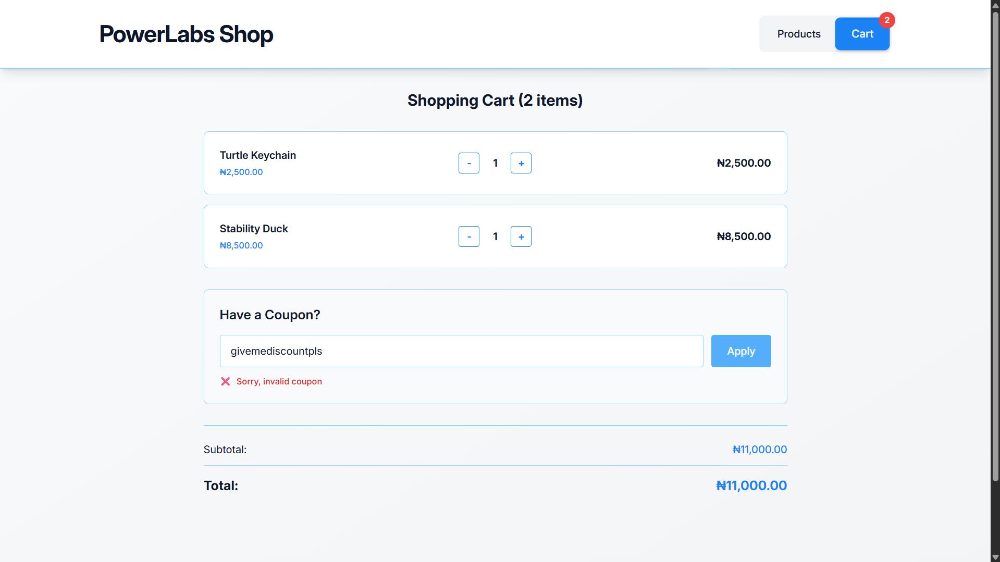
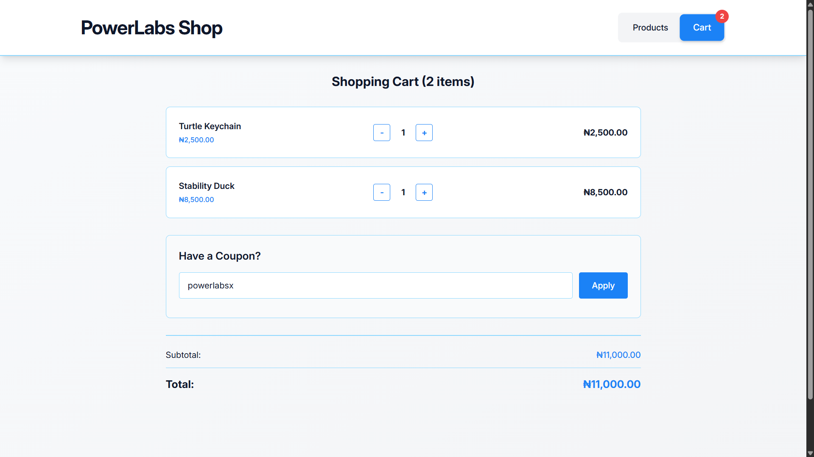
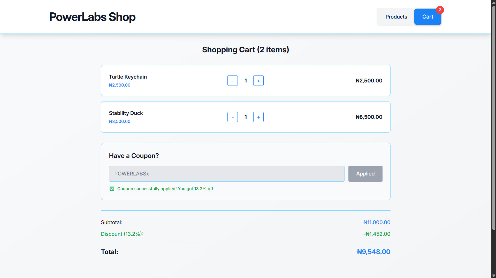

# PowerLabs SE Intern Skill Assessment
## Content Outline
- [About](#about)
- [Project Setup](#project-setup)
    - [Prerequisites](#prerequisites)
    - [Steps](#steps)
- [Project Demo](#project-demo)
    - [Live Link](#project-link)
    - [Screenshots](#screenshots)
- [My Process](#my-process)
    - [Built With](#built-with)
    - [Resources Used](#resources-used)
- [Author](#author)


## About
This project is the second stage in the application process for a Software Engineering internship at PowerLabs.

It is a basic shop, where users can:
- View product details, including an image, product name and short product description
- Add items to cart
- Switch to the Cart page at the top right
- Increase or decrease the number of each item selected, or remove the item(s) altogether
- Apply any coupon codes (but only the correct coupon applies a discount to the total)

## Project Setup
### Prerequisites
- [Node.js (>= v18)](https://nodejs.org/en/download)
- [Node Package Manager](https://npmjs.com/)

### Steps
1. **Clone this repo**:
    - From GitHub:

        Click this big green button:
        
        Choose your preferred method from the provided dropdown (use GitHub Desktop if you have it):
        

    - From the CLI:
    ```bash
    git clone https://github.com/akcumeh/powerlabs-se-intern-skills-test.git
    ```

2. In your terminal, **install the dependencies** using
    ```bash
    npm i
    ```

3. **Start the server** with
    ```bash
    npm run dev
    ```

    This opens the page in your browser (most likely at `https://localhost:5173`).

4. Enjoy the shop! You can browse items, see product details, and add any items that catch your fancy to cart. Try using **`POWERLABSx`** for a sweet discount!


## Project Demo
### Project link
This project is currently live [here](https://akcumeh.github.io/powerlabs-se-intern-skills-test).

### Screenshots
Shopfront on Desktop




Shopfront on Mobile




Cart Pages





Discount Functionality
- Wrong coupon codes:




- Correct coupon code



UX Flow


(If this video is not being rendered, kindly visit [here](https://drive.google.com/file/d/1zg_HTU9p6o8caAgrnO5WyhL_yEqWFUy7/view?usp=sharing).)

## My Process
### Built With
- Frontend: [React.JS](https://react.dev), [TailwindCSS](https://tailwindcss.com)
- Build: [Vite](https://vite.dev/guide/)
- Deployment & Hosting: [GitHub Pages](https://github.com)

### Resources Used
- [Vite](https://vite.dev/guide/)
- [TailwindCSS Docs](https://tailwindcss.com/docs/)
- [Node.JS](https://nodejs.org/)
- [Exposing link on network in Vite](https://dev.to/kadea-academy/how-to-expose-vite-local-instance-to-the-network-eg-mobile-device-if4)
- [Question - embedding videos in markdown](https://github.com/orgs/community/discussions/133813)

And of course, [simple Google search](https://google.com). :D

## Author
Thank you for reading up to this point!

Check out my profiles here:
- [X (fka Twitter) - @akcumeh](https://x.com/akcumeh)
- [GitHub - @akcumeh](https://github.com/akcumeh)
- [LinkedIn - Angel Umeh](https://linkedin.com/in/angelumeh/)

The products displayed in this shop are **real** crochet items crafted by **me**. If you would actually like to purchase any of them, or you have other ideas in mind, feel free to reach out on [Telegram](https://t.me/yarnandmk) as well.